# LUI

	A Vue.js UI Toolkit for Web

`卢超`<br />`2017/06/17`
****

### 按钮

>按钮类型 默认/danger/success/warning 四种 [type="danger"]

```html
 <lu_button>默认按钮</lu_button>
 <lu_button type="danger">危险按钮</lu_button>
 <lu_button type="success">成功按钮</lu_button>
 <lu_button type="warning">警告按钮</lu_button>
```


>滑过按钮 四种类型 同上 [:plain="true"]

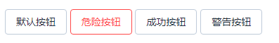

>按钮大小 超大(large) / 默认 / 小型(small) / 超小型(mini) 四种 [size="large"]

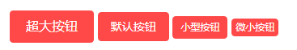

>去除按钮默认圆角 [:radius="false"]

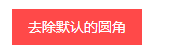

>按钮禁用 [:disabled="true"]

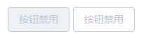

>按钮添加图标 icon="lu-icon-delete2"

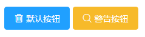

### Badge 标记

>数据[:value="97786"] 隐藏Badge [:hidden="true"] 默认false，是否红点显示 [:isDot="true"] 默认 false 设置颜色[color="#333"] 默认 红色

```html
<lu_badge :value="97786" color="#333">
    <lu_button size="small">小型按钮</lu_button>
</lu_badge>

<lu_badge :value="7245" :isDot="true">
    <lu_button size="small">小型按钮</lu_button>
</lu_badge>

<lu_badge :value="7245" :hidden="true">
    <lu_button size="small">小型按钮</lu_button>
</lu_badge>
```

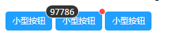

### 移动端 信息弹窗提示

>提示信息字符串[message:string], 显示位置[position:top/middle/boottom], 显示时间长度[duration:time] 添加自己的class[className="my-class"]

```javascript
this.$lu_toast({
	message: '信息弹窗提示',
	position: 'top',
	duration: 1500
});
```

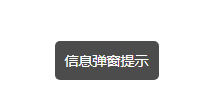

### switch 开关

>@change,@input事件，返回值 true/false , 绑定初始值[v-model=" "] , 禁用[:disabled="true"]

```html
<lu_switch v-model="witch1" @change="change1">{{witch1}}</lu_switch>
<lu_switch v-model="witch2" @input="input1" :disabled="true">{{witch2}}</lu_switch>
```


### PC端 信息弹窗提示

>默认（info）/error/success/warning 四种 [type="danger"]

```javascript
this.$lu_message({
    type:'error',
    message: '危险错误提示'
})
或
this.$lu_message.error('危险错误提示')
```

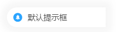
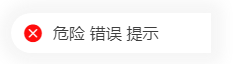
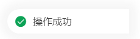
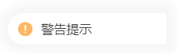

### input输入框

>v-model="value"绑定值，maxlength最大输入长度 ，输入框大小 超大(large) / 默认 / 小型(small) / 超小型(mini) 四种 [size="large"],输入时触发@input=" "

```html
<lu_input 
    v-model="inputValue0" 
    maxlength="5" 
    size="large" 
    @input="changeInput"
    @focus="focusInput"
    @blur="blurInput" />
```

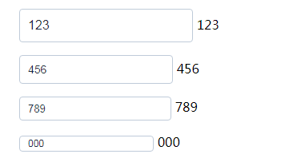

### tag标签

>类型 (默认) / gray / primary / success / warning / danger 六种 也可以通过color="#009e4d"设置背景色 是否可关闭 :closable="true" 默认false

```html
<lu_tag :closable="true" @close="closeTag(1)">默认标签</lu_tag>
<lu_tag type="gray" :closable="true">gray标签</lu_tag>
<lu_tag type="primary" :closable="true">primary标签</lu_tag>
<lu_tag type="success" :closable="true">success标签</lu_tag>
<lu_tag type="warning" :closable="true">warning标签</lu_tag>
<lu_tag type="danger" :closable="true">danger标签</lu_tag>
<lu_tag color="#009e4d" :closable="true" @close="closeTag(2)">自定义背景色标签</lu_tag>
```

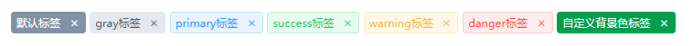


> git log 记录

* 2018-08-06 11:39:55 feat:DatePicker
* 2018-08-08 00:41:05 feat:DatePicker组件完成
* 2018-08-08 10:34:49 feat:添加若干iconfont图标
* 2018-08-08 11:33:52 feat:完善lu_pagination组件