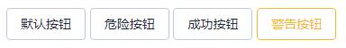
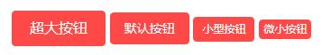
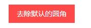
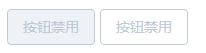
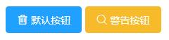

# LUI
### 按钮
<p>按钮类型 默认/danger/success/warning 四种 [type="danger"]</p>

```html
 <lu_button>默认按钮</lu_button>
 <lu_button type="danger">危险按钮</lu_button>
 <lu_button type="success">成功按钮</lu_button>
 <lu_button type="warning">警告按钮</lu_button>
```


<p>滑过按钮 四种类型 同上 [:plain="true"]</p>



<p>按钮大小 超大(large) / 默认 / 小型(small) / 超小型(mini) 四种 [size="large"]</p>



<p>去除按钮默认圆角 [:radius="false"]</p>



<p>按钮禁用 [:disabled="true"]</p>



<p>按钮添加图标 icon="lu-icon-delete2"</p>

