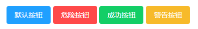

# LUI
### 按钮

<p>按钮类型 默认/danger/success/warning 四种 [type="danger"]</p>

```html
 <lu_button>默认按钮</lu_button>
 <lu_button type="danger">危险按钮</lu_button>
 <lu_button type="success">成功按钮</lu_button>
 <lu_button type="warning">警告按钮</lu_button>
```



<p>滑过按钮 四种类型 同上 [:plain="true"]</p>


<p>按钮大小 超大(large) / 默认 / 小型(small) / 超小型(mini) 四种 [size="large"]</p>


<p>去除按钮默认圆角 [:radius="false"]</p>


<p>按钮禁用 [:disabled="true"]</p>


<p>按钮添加图标 icon="lu-icon-delete2"</p>


### Badge 标记

<p>数据[:value="97786"] 隐藏Badge [:hidden="true"] 默认false，是否红点显示 [:isDot="true"] 默认 false 设置颜色[color="#333"] 默认 红色</p>

```html
<lu_badge :value="97786" color="#333">
    <lu_button size="small">小型按钮</lu_button>
</lu_badge>

<lu_badge :value="7245" :isDot="true">
    <lu_button size="small">小型按钮</lu_button>
</lu_badge>

<lu_badge :value="7245" :hidden="true">
    <lu_button size="small">小型按钮</lu_button>
</lu_badge>
```


### 移动端 信息弹窗提示

<p>提示信息字符串[message:string], 显示位置[position:top/middle/boottom], 显示时间长度[duration:time] 添加自己的class[className="my-class"]</p>

```javascript
this.$lu_toast({
	message: '信息弹窗提示',
	position: 'top',
	duration: 1500
});
```


### switch 开关

<p>@change,@input事件，返回值 true/false , 绑定初始值[v-model=" "] , 禁用[:disabled="true"]</p>

```html
<lu_switch v-model="witch1" @change="change1">{{witch1}}</lu_switch>
<lu_switch v-model="witch2" @input="input1" :disabled="true">{{witch2}}</lu_switch>
```

